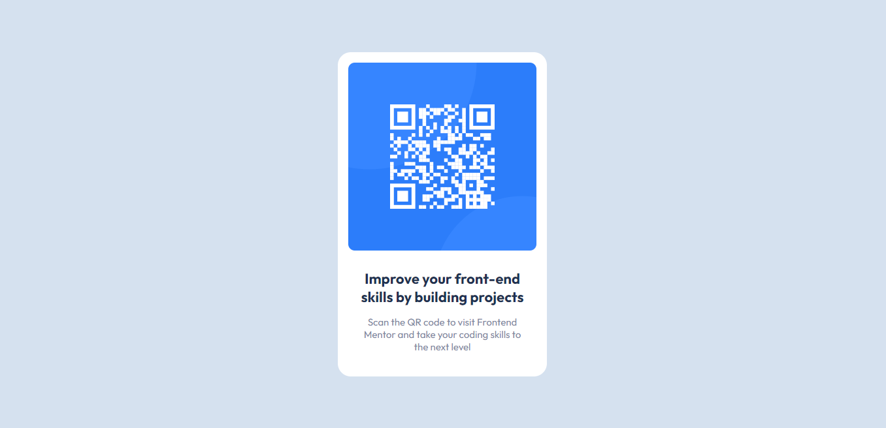

# Frontend Mentor - QR code component solution

This is a solution to the [QR code component challenge on Frontend Mentor](https://www.frontendmentor.io/challenges/qr-code-component-iux_sIO_H). Frontend Mentor challenges help you improve your coding skills by building realistic projects. 

## Table of contents

- [Overview](#overview)
  - [Screenshot](#screenshot)
  - [Links](#links)
- [Author](#author)

## Overview

### Screenshot

### Links

- Solution URL: [https://www.frontendmentor.io/solutions/qr-code-component-by-yajvendra-saini-html-css-3ItKSn0y0R](https://www.frontendmentor.io/solutions/qr-code-component-by-yajvendra-saini-html-css-3ItKSn0y0R)
- Live Site URL: [https://yajvendrasaini.github.io/QR-code-component/](https://yajvendrasaini.github.io/QR-code-component/)

## Author

- Linkedin - [Yajvendra Saini](https://www.linkedin.com/in/yajvendra-saini-a961601b7/)
- Frontend Mentor - [@YajvendraSaini](https://www.frontendmentor.io/profile/YajvendraSaini)
- Twitter - [@yajvendrasaini](https://www.twitter.com/yajvendrasaini)

